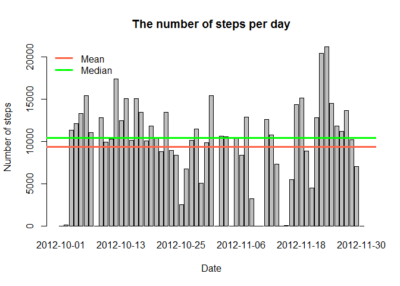

# Reproducible Research: Peer Assessment 1
### Author: Varvara Krayvanova

## Introdution for checkers

For more convinient to read I insert computed values into text. All digits printed by bold font in the report obtained using code chunks like this:

```
Bla-bla-bla 'r some variable' bla-bla-bla.
```

## Loading and preprocessing the data

We read data from file and transform dates to class Date. Also we convert interval code into hours and minutes. And we need weekend marker for last question. Next code chunk form dataset to `stepDataSet`. 


```r
library(lubridate)

stepDataSet <- read.csv("../data/activity.csv")

stepDataSet$date <- as.Date(stepDataSet$date)
stepDataSet$weekend <- ((wday(stepDataSet$date)==1) | (wday(stepDataSet$date)==7))

stepDataSet$minutes <- stepDataSet$interval%%100
stepDataSet$hours <- stepDataSet$interval%/%100
stepDataSet$dayMinutes <- stepDataSet$hours*60+stepDataSet$minutes
```

## What is mean total number of steps taken per day?

To answer this question we transform our dataset to `stepByDays`. It is an integer vector. Every element of this vector contains the total number of steps taken each day and is annotated by date. Then we calculate mean and median for transformed dataset.  


```r
stepByDays <- sapply(split(stepDataSet,stepDataSet$date),
                   function(x) {
                     sum(x$steps,na.rm = TRUE)
                   })
meanPerDays <- mean(stepByDays)
medianPerDays <- median(stepByDays)
```

So, the mean of the total number of steps per day is **9354.2295**, and the median of this parameter is  **10395**.

Let's plot а histogram to show the parameter in the dynamics:


```r
barplot(stepByDays,main = "The number of steps per day",xlab ="Date",ylab ="Number of steps")
abline(h=meanPerDays,col="tomato", lwd = 3)
abline(h=medianPerDays,col="green", lwd = 3)
legend ("topleft", 
		legend = c("Mean","Median"),
		col = c("tomato","green"),
		lwd = c(3,3),bty="n")
```

 

## What is the average daily activity pattern?

Let's look at our data in another slice. Steps Statistics can tell us about a person's lifestyle. Next code computs average number of steps taken, averaged across all days. This data is placed into `stepByIntervals`.


```r
stepByIntervals <- sapply(split(stepDataSet,stepDataSet$dayMinutes),
                   function(x) {
                     mean(x$steps,na.rm = TRUE)
                   })

maxActivity <- max(stepByIntervals)
maxActivityPerMinute <- maxActivity/5
timeMaxAxtivity <- as.integer(names(stepByIntervals[stepByIntervals==maxActivity]))
timeMaxAxtivityHour <- timeMaxAxtivity%/%60
timeMaxAxtivityMinutes <- timeMaxAxtivity%%60
plot(as.integer(names(stepByIntervals))/60, stepByIntervals, 
     type = "l",
     main = "Average daily activity pattern",
     xlab ="Time (of day, in hours)",
     ylab ="Average number of steps across all days")
abline(v=timeMaxAxtivity/60,col="tomato", lwd = 3)
abline(v=5.5,col="green", lwd = 3)
abline(v=19.5,col="green", lwd = 3)
abline(v=22,col="green", lwd = 3)
```

 

We are seeing a clear maximum at **8:35** five-minutes interval.

But what about anonymous person? Usually this person wakes up at 5:30 and go to bed in period between 19:30 and 22:00. These numbers are not calculated, I just added it to the plot (green lines). In peak we observe **`41.234`** steps in a minute. [Wiki](https://en.wikipedia.org/wiki/Running) told us that these is more than 100 the number of steps per minute when running and race walking. So, near 8:30 our person just goes to work.

## Imputing missing values

There are a number of days/intervals where there are missing values. The presence of missing days may introduce bias into some calculations or summaries of the data. Let's compute, how many NAs in `stepDataSet`.


```r
naCount <-sum( is.na(stepDataSet$steps))
notCompleteCases <- sum(!complete.cases(stepDataSet))
```
There is **2304** NA values and **2304** not complete cases in dataset.

The strategy for filling in all of the missing values in the dataset I used is to replace all NAs by the mean for that 5-minute interval from `stepByIntervals`.


```r
stepDataSetWithoutNA <- stepDataSet

for (i in 1:nrow(stepDataSetWithoutNA))
{
  newRow <- stepDataSetWithoutNA[i,]
  if (is.na(newRow$steps))
  {
    newRow$steps <- stepByIntervals[as.character(newRow$dayMinutes)] 
  }
  stepDataSetWithoutNA[i,] <- newRow  
}
```

Let's compute `stepByDaysWithoutNA` the same way as `stepByDays` in first question, and calculate mean and median for this dataset.


```r
stepByDaysWithoutNA <- sapply(split(stepDataSetWithoutNA,stepDataSetWithoutNA$date),
                   function(x) {
                     sum(x$steps,na.rm = TRUE)
                   })

meanPerDaysWithoutNA <- as.character(mean(stepByDaysWithoutNA))
medianPerDaysWithoutNA <- as.character(median(stepByDaysWithoutNA))
```

<table border=1 bordercolor=gray>
    <tr>
        <th>Initial data set</th><th>After NAs replacement</tr>
    </tr>
    <tr>
        <td>9354.2295</td><td>10766.1886792453</td>
    <tr>
    </tr>
        <td>10395</td><td>10766.1886792453</td>
    </tr>
</table>

We see, that after NA replacement the median and the mean are almost identical.


```r
barplot(stepByDaysWithoutNA,main = "The number of steps per day",xlab ="Date",ylab ="Number of steps")
abline(h=meanPerDaysWithoutNA,col="tomato", lwd = 3)
abline(h=medianPerDaysWithoutNA,col="green", lwd = 3)
legend ("topleft", 
  	legend = c("Mean","Median"),
		col = c("tomato","green"),
		lwd = c(3,3),bty="n")
```

 

## Are there differences in activity patterns between weekdays and weekends?

To answer this question let's split our dataset into two datasets: `weekendSteps` and `weekdaySteps`. Next code fragment computes averange daily activity pattern for weekends.


```r
weekendSteps <- stepDataSet[stepDataSet$weekend,]
weekendRows <- nrow(weekendSteps)
tmpWeekendStepByIntervals <- sapply(split(weekendSteps,weekendSteps$dayMinutes),
                   function(x) {
                     mean(x$steps,na.rm = TRUE)
                   }) 
weekendStepByIntervals = data.frame(
  dayMinutes = as.integer(names(tmpWeekendStepByIntervals)),
  avg = tmpWeekendStepByIntervals
  )
```
And next code chunk do the same for weekdays.


```r
weekdaySteps <- stepDataSet[!stepDataSet$weekend,]
weekdayRows <- nrow(weekdaySteps)
tmpWeekdayStepByIntervals <- sapply(split(weekdaySteps,weekdaySteps$dayMinutes),
                   function(x) {
                     mean(x$steps,na.rm = TRUE)
                   }) 
weekdayStepByIntervals = data.frame(
  dayMinutes = as.integer(names(tmpWeekdayStepByIntervals)),
  avg = tmpWeekdayStepByIntervals
  )
```

There are 4608 rows for weekends and 12960 rows for weekdays. Now look at the dynamics of steps number for weekends and weekdays. 

I see no reason to merge data sets for weekdays and weekends, so here I use [multiplot](http://www.cookbook-r.com/Graphs/Multiple_graphs_on_one_page_%28ggplot2%29/) function for `ggplot` package.


```r
library(ggplot2)
library(grid)
source("../scripts/multiplot.R")

p1 <- qplot(
   weekendStepByIntervals$dayMinutes, 
   weekendStepByIntervals$avg,
   geom = "line",
   main = "Average daily activity pattern for weekends",
   xlab = "Time (of day, in hours)",
   ylab = "Average number of steps",
   ylim = c(0,300))

p2 <- qplot(
   weekdayStepByIntervals$dayMinutes, 
   weekdayStepByIntervals$avg,
   geom = "line",
   main = "Average daily activity pattern for weekdays",
   xlab = "Time (of day, in hours)",
   ylab = "Average number of steps",
   ylim = c(0,300))

multiplot(p1, p2, cols=1)
```

 

We can see, that wake up time is much more variable for weekends. All weekend day passes more actively and ends much later than weekday.
